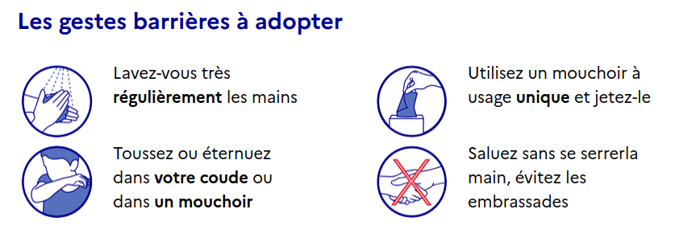

```{r setup, include=FALSE}
knitr::opts_chunk$set(echo = TRUE)
load("pandemy.RData") 
library(dplyr)
library(highcharter)
library(xtable)
library(viridisLite)
library(knitr)
library(kableExtra)
colors <- viridis(4)
colors <- substr(colors,0,7)
```

## Préambule

[Yves Tillé](https://www.linkedin.com/in/yves-till%C3%A9-78b81413/), université de Neuchâtel, a publié sur Linkedin le 19 mars 2020 un [article](https://www.linkedin.com/posts/yves-till%C3%A9-78b81413_un-mod%C3%A8le-ultrasimple-d%C3%A9pid%C3%A9mie-montre-limportance-activity-6646379162045042688-6C8O) sur un modèle d'épidémie pour confirmer l'importance des consignes de distanciation et d'hygiène. Ce modèle très simple n'est pas une prévision de la pandémie actuelle ; il permet de comprendre l'impact du respect de consignes de distanciation et de gestes barrières sur le système de santé.

Les modèles utilisés ici s'inspirent très fortement de l'article d'Yves Tillé. Sans chercher à modéliser la réalité (ni prévoir l'avenir d'ailleurs), j'ai voulu mieux comprendre l'impact d'une évolution des consignes dans le temps. Pour ce faire, je fais varier différents paramètres (distanciation et contagion) au cours d'une période de 365 jours.

## Les modèles

Comme évoqué plus haut, le modèle est relativement basique. On simule une population de `N` individus, dont dix sont contaminés. Chaque jour (c'est à dire à chaque temps `t`), chaque individu a un contact avec `C` autres individus sélectionnés aléatoirement dans la population. Le nombre de contacts est une variable de Poisson de paramètre `C`. Si une personne saine entre en contact avec une personne contaminée, elle a une probabilité `p` d'être infectée. Après `n1` jours d'incubation, une personne infectée devient contagieuse. La durée d'incubation est une variable de Poisson de paramètre `5` (temps moyen d'incubation du COVID19). Après `n2` jours de contagion, une personne peut développer une forme plus grave de la maladie, avec une probabilité de `g` ou guérir. Après `n3` jours de forme grave de la maladie, une personne peut mourir, avec une probabilité de `d` ou guérir.

J'ai cherché à créer plusieurs _scenarii_ pour évaluer les impacts des consignes. Les consignes de confinement sont modélisées en faisant varier le paramètre `C` : 15 sans confinement, 4 en confinement. Les gestes barrières sont modélisés par le paramètre `p` : `3%` sans geste et `1.5%` avec gestes.

Comme j'habite le 11e arrondissement de Paris, et non Neuchâtel, j'ai généré une population de `N = 150000` individus et simulé la pandémie sur une période de 365 jours. 

J'ai ensuite retenu 4 _scenarii_ :

* modèle 1 **sans consignes de confinement ou de gestes barrières** : `C=15`, `p=.03`, `g=.15`,`d=.1` 

* modèle 2 **avec consignes de confinement, puis déconfinement dans le temps** : `C=15` pour les 90 premiers jours, `C=4` pour les 90 jours suivants, `C=8`, puis `C=10`, `p=.03`, `g=.15`,`d=.1` 

* modèle 3 **avec consignes de confinement, puis déconfinement et gestes barrières** : `C` identique au modèle 2, `p=.03` sur les 180 premiers jours, puis `p=.015`, `g=.15`,`d=.1` 

* modèle 4 **sans consignes de confinement et avec gestes barrières** : `C=15`, `p=.03` sur les 180 premiers jours, puis `p=.015`, `g=.15`,`d=.1`

(extrait du code)

```{r go_models, eval=F, echo=T}
# Simulation avec les paramètres par défaut
res1 <- pandemy()

# Simuation avec une distancation variable dans le temps correspondant aux consignes de confinement
contacts <- c(rep(15,90),rep(4,90),rep(8,85),rep(10,100))
res2 <- pandemy (contacts = contacts)

# Simuation avec une distanciation variable dans le temps correspondant aux consignes de confinement et la mise en place de gestes barrières
contacts <- c(rep(15,90),rep(4,90),rep(8,85),rep(10,100))
contagiosity=c(rep(.03,180),rep(.015,185))
res3 <- pandemy (contacts = contacts, contagiosity = contagiosity)

# Simuation sans confinement, mais avec la mise en place de gestes barrières
contagiosity <- c(rep(.03,90),rep(.015,275))
res4 <- pandemy (contagiosity = contagiosity)
```

## Les résultats

La mise en graphique des simulations permet de mieux comprendre l'évolution de l'état de santé des individus tout au long de l'épidémie : sain, contaminé, contagieux, grave, mort et guéri. 

**Rappelons une nouvelle fois que ces résultats ne modèlisent pas la réalité, mais éclairent sur les conséquences des consignes prises par le gouvernement pour protéger la population, et notamment les plus fragiles.**

Sans surprise, sans mesure de confinement ou de gestes barrières, la progression de la pandémie est très rapide. Une très grande majorité de la population est contaminée. Au 125e jour, le nombre de nouvelles contaminations diminue fortement, car avec près de 2/3 de la population contaminée, il y a une immunité de groupe.

Pour les modèles 2, 3 et 4, la dynamique des contaminations est différente : on voit l'effet du confinement ou des gestes barrières aux environs du 95e jour, ce qui correspond au délai moyen d'incubation (5 jours) après l'annonce des consignes.

Toujours sur les modèles 2, 3 et 4, au 250e jour, le nombre de nouvelles contaminations est très faible voire nul. Le respect des consignes permet de stopper la propagation de la maladie.

En revanche, dans le modèle 2 qui prévoit un déconfinement, de nouvelles contaminations augmentent de nouveau très vite jusqu'au 350e jour. Ce nouveau pic de contamination est possible en raison du changement de comportement des individus avec un déconfinement et une immunité de groupe trop faible. C'est un effet _rebond_ du confinement mis en place au 90e jour : la population saine reste majoritaire permettant au virus de circuler de nouveau.

```{r graph_contagieux, echo=FALSE, out.width = '50%'}
contagieux <- as.data.frame(cbind(res1$Contagieux,res2$Contagieux,res3$Contagieux,res4$Contagieux))
hc <- highchart() %>% 
  #hc_xAxis(categories = citytemp$month) %>% 
  hc_add_series(name = "(1) Contagieux sans confinement", data = contagieux$V1) %>% 
  hc_add_series(name = "(2) Contagieux avec confinement", data = contagieux$V2) %>% 
  hc_add_series(name = "(3) Contagieux avec confinement et gestes barrières", data = contagieux$V3) %>% 
  hc_add_series(name = "(4) Contagieux sans confinement et avec gestes barrières", data = contagieux$V4)
hc %>%
  hc_title(text="Evolution du nombre de cas contagieux pendant l'épidémie",align="left") %>%
  hc_subtitle(text="Individus susceptibles de contaminer d'autres contacts ",align="left") %>%
  hc_colors(colors) %>%
  hc_xAxis(plotLines=list(
    list(label=list(text="Annonce des mesures"),
         color='#DFDFDF',value=90)))
```

Concernant les cas les plus graves qui nécessitent une hospitalisation, les courbes ont globalement la même forme que pour les contaminations, mais plus faible en volume. Ces évolutions éclairent en revanche sur l'effet de pression forte sur le système de santé.

Le respect des consignes permet de maintenir une pression plus soutenable.

```{r graph_grave, echo=FALSE, out.width = '50%'}
grave <- as.data.frame(cbind(res1$Grave,res2$Grave,res3$Grave,res4$Grave))
hc <- highchart() %>% 
  hc_add_series(name = "(1) Graves sans confinement", data = grave$V1) %>% 
  hc_add_series(name = "(2) Graves avec confinement", data = grave$V2) %>% 
  hc_add_series(name = "(3) Graves avec confinement et gestes barrières", data = grave$V3) %>% 
  hc_add_series(name = "(4) Graves sans confinement et avec gestes barrières", data = grave$V4)
hc %>%
  hc_title(text="Evolution du nombre de cas graves pendant l'épidémie",align="left") %>%
  hc_subtitle(text="Cas néssitant une hospitalisation",align="left") %>%
  hc_colors(colors) %>%
  hc_xAxis(plotLines=list(
    list(label=list(text="Annonce des mesures"),
         color='#DFDFDF',value=90))) %>%
  hc_yAxis(title=list(text="Nombre d'individus"),
           plotBands=list(
             list(from=1500, to=JS('Infinity'), color='rgba(100,0,0,0.1)')))
```

De même, le respect des consignes de distanciation et des gestes barrières permet de limiter le nombre de décès (comparaison des modèles 2, 3 et 4 avec le modèle 1). Le nombre de décès du modèle 3 est Plus de 8 fois inférieur au modèle 1.

```{r graph_mort, echo=FALSE, out.width = '50%'}
mort <- as.data.frame(cbind(res1$Mort,res2$Mort,res3$Mort,res4$Mort))
hc <- highchart() %>% 
  #hc_xAxis(categories = citytemp$month) %>% 
  hc_add_series(name = "(1) Morts sans confinement", data = mort$V1) %>% 
  hc_add_series(name = "(2) Morts avec confinement", data = mort$V2) %>% 
  hc_add_series(name = "(3) Morts avec confinement et gestes barrières", data = mort$V3) %>% 
  hc_add_series(name = "(4) Morts sans confinement et avec gestes barrières", data = mort$V4)
hc %>%
  hc_title(text="Evolution du nombre de décès pendant l'épidémie",align="left") %>%
  hc_colors(colors) %>%
  hc_xAxis(plotLines=list(
    list(label=list(text="Annonce des mesures"),
         color='#DFDFDF',value=90)))
```


```{r graph_sain, echo=FALSE, out.width = '50%'}
sain <- as.data.frame(cbind(res1$Sain,res2$Sain,res3$Sain,res4$Sain))
hc <- highchart() %>% 
  #hc_xAxis(categories = citytemp$month) %>% 
  hc_add_series(name = "(1) Sain sans confinement", data = sain$V1) %>% 
  hc_add_series(name = "(2) Sain avec confinement", data = sain$V2) %>% 
  hc_add_series(name = "(3) Sain avec confinement et gestes barrières", data = sain$V3) %>% 
  hc_add_series(name = "(4) Sain sans confinement et avec gestes barrières", data = sain$V4)
hc %>%
  hc_title(text="Evolution du nombre d'individus sains pendant l'épidémie",align="left") %>%
  hc_colors(colors) %>%
  hc_xAxis(plotLines=list(
    list(label=list(text="Annonce des mesures"),
         color='#DFDFDF',value=90)))
```

## En synthèse

Prenons quelques indicateurs pour comparer les différent modèles :

```{r stats, echo=FALSE}
immunity <- c(res1$Guéri[365] / rowSums(res1[365,]) * 100,
              res2$Guéri[365] / rowSums(res2[365,]) * 100,
              res3$Guéri[365] / rowSums(res3[365,]) * 100,
              res4$Guéri[365] / rowSums(res4[365,]) * 100)
mortality <- c(res1$Mort[365] / (rowSums(res1[365,])-res1$Sain[365]) * 100,
               res2$Mort[365] / (rowSums(res2[365,])-res2$Sain[365]) * 100,
               res3$Mort[365] / (rowSums(res3[365,])-res3$Sain[365]) * 100,
               res4$Mort[365] / (rowSums(res4[365,])-res4$Sain[365]) * 100)
countdead <- c(res1$Mort[365], res2$Mort[365], res3$Mort[365], res4$Mort[365])
picgrave  <- c(max(res1$Grave), max(res2$Grave), max(res3$Grave), max(res4$Grave))
nbgrave   <- c(sum(res1$Grave>=500), sum(res2$Grave>=500), sum(res3$Grave>=500), sum(res4$Grave>=500))
tab <- as.data.frame(t(rbind(immunity,mortality,countdead,picgrave,nbgrave)))
colnames(tab) <- c('Taux immunité','Taux mortalité','Nb de morts','Pic du nb de cas graves','Nb de jours avec plus de 500 cas graves ')
rownames(tab) <- c('Modèle 1 : sans consignes de confinement ou de gestes barrières','Modèle 2 : avec consignes de confinement et de déconfinement dans le temps','Modèle 3 : avec consignes de confinement et de déconfinement et gestes barrières','Modèle 4 : sans consignes de confinement et avec gestes barrières')
tab %>%
  kable(digits = 2) %>%
  kable_styling()
```


## Que retenir ?

* Le respect des consignes de confinement et de gestes barrières ont des effets importants sur la santé des individus et du système de santé. En l'abence d'un traitement contre la maladie, elles sont essentielles pour garantir la santé de tous (et donc des plus faibles).

* Le déconfinement progressif est envisageable au 180e jour (fin juin dans les modèles proposés), mais doit être obligatoirement accompagné de mesures strictes sur les gestes barrières pour freiner au maximum les nouvelles contaminations qui en résulteraient. Sans respect des gestes barrières, un nouveau pic de contamination survient quelques semaines plus tard.


## COVID_19

* Site du gouvernement traitant de la crise : https://www.gouvernement.fr/info-coronavirus

* rappel des gestes barrières 


